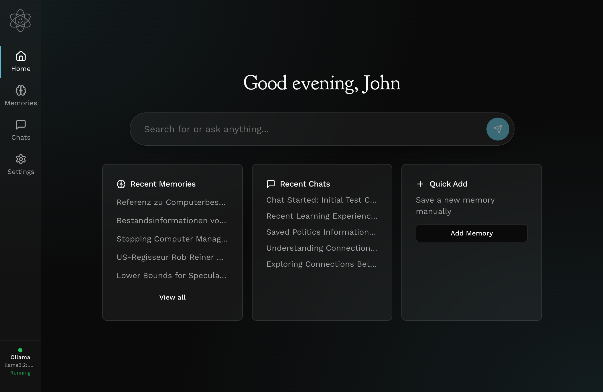

# Think

[](https://opensource.org/licenses/Apache-2.0)

Personal AI assistant for saving and chatting with web content.



## Prerequisites

- [Node.js](https://nodejs.org/) 20+
- [pnpm](https://pnpm.io/) (not npm/yarn)
- [Python](https://www.python.org/) 3.12
- [Poetry](https://python-poetry.org/)
- [Ollama](https://ollama.ai/) (optional - app can auto-install)

## Platform Notes

**macOS**: Install sqlcipher for database encryption:
```bash
brew install sqlcipher
```

**Windows**: Works out of the box. Ensure Python 3.12 is in PATH.

## Setup

```bash
# Install dependencies
pnpm install

# Install backend
cd backend && poetry install
```

## Development

```bash
# Terminal 1: Start backend
cd backend && poetry run uvicorn app.main:app --reload --port 8765

# Terminal 2: Start Electron app
pnpm app

# Terminal 3: Watch extension changes
pnpm --filter think-extension dev
```

## Project Structure

```
think/
├── app/          # Electron + React desktop app
├── backend/      # Python FastAPI server
└── extension/    # Chrome extension (React)
```

## Tech Stack

- **Frontend**: React + TypeScript + Tailwind + shadcn/ui
- **Desktop**: Electron
- **Backend**: Python + FastAPI
- **Extension**: Chrome Manifest V3 + React

## Documentation

- [Chrome Extension Setup](docs/extension.md)
- [Building for Distribution](docs/distribution.md)

## Contributing

See [CONTRIBUTING.md](CONTRIBUTING.md) for guidelines.

## License

[Apache 2.0](LICENSE)
